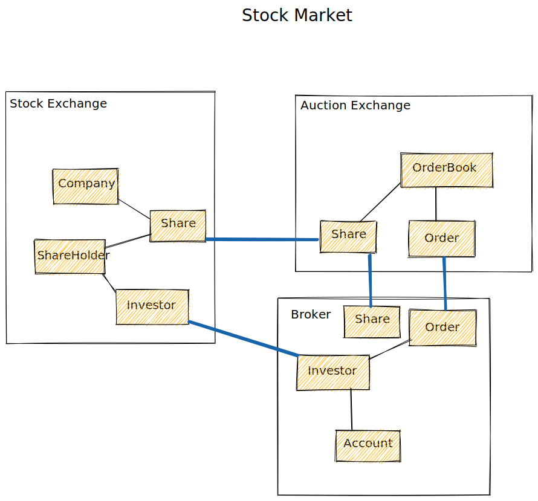

# Stock Market
This application creates a fake process between brokers and a stock exchange by applying the microservices concepts with Clean Architecture, DDD, SAGA, Outbox, CQRS and Kafka

PS. Please, don't take seriously the domain concept because it's much more complicated than this =D I've just tried to use it as simply as possible with the main focus on applying the concepts mentioned above.

## Boundary Context

**Stock Exchange** will be responsible to hold the shares, company, and shareholders' information

**Auction Exchange** will execute the bid and ask (buy and ask) and define the price

**Broker** will manage the accounts of the investors holding their shares, their money and send their orders to the auction

## Requirements
[Broker](broker-service/README.md)