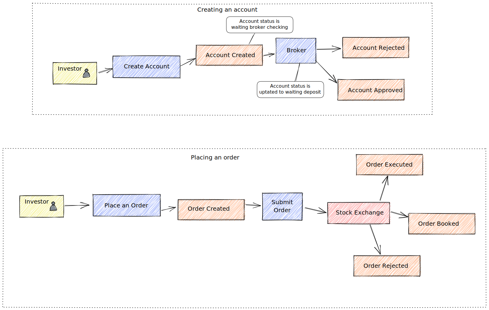

# Broker Service

## Functional requirements

- A new user should be able to create an investor account
    - Conditions:
        - should have a initial deposit of R$ 10 reais
        - should be a valid CPF (Brazilian ID)
        - should not accept under 18 years old

- The investor should be able to buy shares and sell it
    - Conditions:
        - For buy they must have the balance equivalent to the total amount plus fees
        - Both operations are possible between 10 am and 5 pm (it's the period that the market is open)
    - Highlights:
        - The broker is only the agent that buys or sells shares to the investor. The investor can change the broker without losing yours shares
## Event flow

## Account Status Flow
