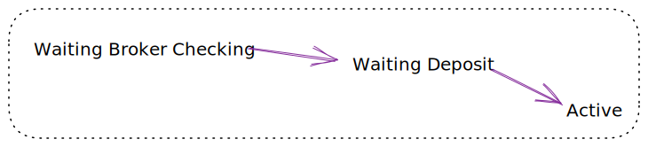
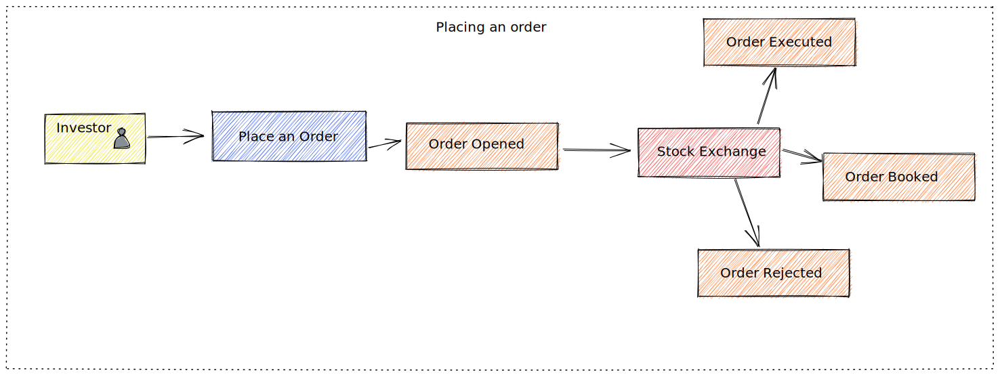

# Broker Service
Application that place the orders to buy/sell shares for an investor and manage the investor's account.

Below the use cases with the functional requirements.

# UC1 - Creating account

- A user should be able to create an investor account
    - Pre Conditions:
        - have an initial deposit of R$10 to consider the account active
        - be a valid CPF (Brazilian ID) ([How to validate it](http://clubes.obmep.org.br/blog/a-matematica-nos-documentos-cpf/))
        - have only one account by CPF
        - not accept under 18 years old
## Account Status Flow

# UC2 - Placing an order

- The investor should be able to place an order to buy or sell shares
    - Pre Conditions:
        - To buy, the user must have the balance equivalent to the total amount plus fees
        - To sell, the user must have the minimum quantity of company shares
        - Both operations are possible between 10 am and 5 pm (it's the period that the market is open)
        - For buy/sell fractional shares the quantity must be minimum 1
        - For buy/sell integral shares the quantity must be minimum 100 and in chunks of 100
    - Highlights:
        - The broker is only the agent that buy or sell shares for the investor and holds the shares. The investor can change the broker migrating your shares to the new one
        - Share are divided in 2 categories, fractional(minimum 1 share) and integral(chunks of 100)
        - The fee is 2% to buy and 5% to sell
    - Post Conditions
      - An order should be sent to the Stock Exchange and marked as open

